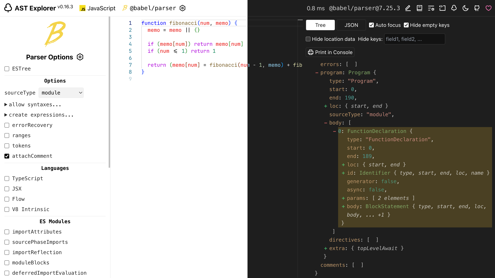

#  AST Explorer

AST Explorer - A web tool to explore the ASTs generated by parsers.

- Stable Release: [ast.sxzz.dev](https://ast.sxzz.dev/)
- Dev Channel: [ast-explorer.vercel.app](https://ast-explorer.vercel.app/)

Feel free to add more languages and parsers via PR!

  

## Features

- 🦾 Enable code highlighting, suggestions, and formatting with Monaco Editor.
- 🤩 Support most popular front-end languages and parsers.
- 🗒️ Save your code via URL. No database, no server downtime.
- 🐙 Customize parser version via CDN, e.g., `@babel/parser` alpha.
- 🌈 Set custom parser options with a GUI.
- 🌚 Good-looking dark mode theme.
- 📱 Even compatible with mobile devices.

## Contributing

To contribute to the project, see [Contribution Guide](https://github.com/sxzz/contribute).

## Credits

- https://astexplorer.net/
- https://play.swc.rs/

## License

[AGPL-3.0](./LICENSE) License © 2023-PRESENT [三咲智子](https://github.com/sxzz)
